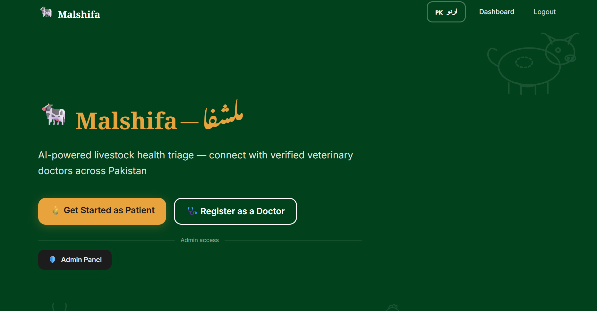
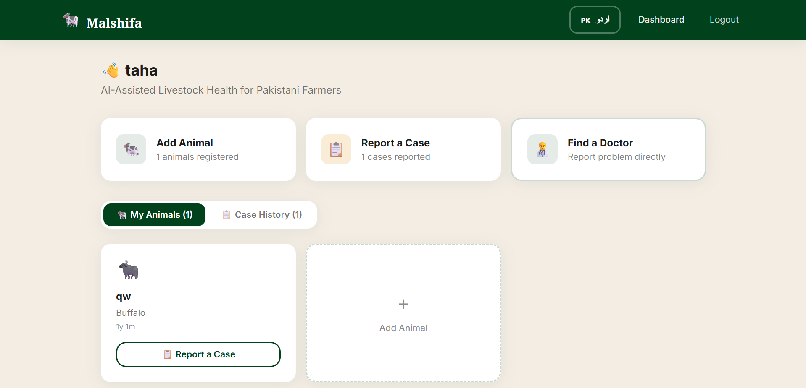

# MalShifa 🐄

AI-Powered Livestock Healthcare Platform for Farmers and Veterinary Doctors

## Overview

MalShifa is an AI-powered livestock healthcare platform designed to help farmers, especially those living in rural and remote areas, get initial guidance about animal health problems.

The name **MalShifa** comes from:
- **Mal (مال)** — Animal/Livestock in Urdu, Punjabi, and Saraiki
- **Shifa (شفا)** — Healing

The platform aims to reduce the communication gap between farmers and veterinary professionals by providing an easy-to-use bilingual system with AI assistance.

---

# Problem It Solves

Many farmers in remote areas face difficulties when their animals become sick:

- Limited access to veterinary doctors
- Difficulty explaining symptoms
- Language barriers
- Delayed treatment due to lack of guidance

MalShifa provides farmers with a simple platform where they can describe their animal's problem, upload images, and receive AI-based preliminary analysis before connecting with a doctor.

---

# Features

## Farmer Features

- User registration and authentication
- Login system
- Urdu and English language support
- Add animal information:
  - Animal name
  - Animal type
  - Age
- Create health cases
- Describe symptoms and problems
- Upload animal images
- Receive AI-based preliminary health analysis
- View submitted cases
- Communicate with assigned doctors

---

## Doctor Features

- Doctor registration
- Doctor authentication
- Upload verification documents
- View available animal cases
- View assigned cases
- Review animal symptoms and details
- Provide recommendations and solutions
- Manage patient cases

---

## Admin Features

- Admin authentication
- View registered doctors
- Approve or reject doctor registrations
- Manage platform users

---

# AI Feature

MalShifa uses **Google Gemini AI** for preliminary livestock health analysis.

The AI analyzes:

- Animal information
- Reported symptoms
- Uploaded images (when available)

The AI provides:

- Possible health conditions
- Urgency level
- Initial recommendations
- Guidance for further action

### AI System Instruction

The AI is instructed to behave as a veterinary assistant that:

- Understands livestock-related problems
- Provides simple explanations suitable for farmers
- Avoids complex medical terminology
- Gives safe preliminary guidance
- Encourages professional veterinary assistance when required

---

# Technology Stack

## Frontend

- Next.js
- React
- TypeScript
- Tailwind CSS

## Backend

- Supabase
- PostgreSQL
- Supabase Authentication
- Supabase Storage

## Artificial Intelligence

- Google Gemini API

## Deployment

- Vercel

---

# Screenshots

## Landing Page



## Farmer Dashboard


## Doctor Dashboard



---

# Environment Setup

Clone the repository:

```bash
git clone YOUR_GITHUB_REPOSITORY_URL

cd malshifa
```

Install dependencies:

```bash
npm install
```

Create a `.env.local` file:

```env
NEXT_PUBLIC_SUPABASE_URL=YOUR_SUPABASE_PROJECT_URL
NEXT_PUBLIC_SUPABASE_ANON_KEY=YOUR_SUPABASE_ANON_KEY
SUPABASE_SERVICE_ROLE_KEY=YOUR_SUPABASE_SERVICE_ROLE_KEY
GEMINI_API_KEY=YOUR_GEMINI_API_KEY
ADMIN_EMAIL=YOUR_ADMIN_EMAIL
```

---

# Running Locally

Start the development server:

```bash
npm run dev
```

Open:

```
http://localhost:3000
```

---

# Deployment

The application is deployed using Vercel.

Live URL:

[```
Y
```](https://fyp-c6vl.vercel.app?_vercel_share=hHugqCqTDL2wStUlsTkZOMjBogP9ojbC)

---

# Project Structure

```
app/
components/
lib/
public/
screenshots/
supabase/
```

---

# Future Improvements

- Real-time doctor-farmer chat
- Voice-based symptom reporting for farmers
- More regional languages
- Improved AI diagnosis accuracy
- Integration with veterinary databases
- Mobile application

---

# Author

Developed as an individual Final Year Project.
